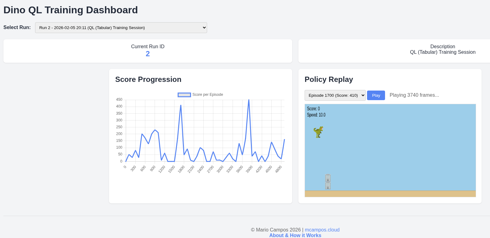

# DinoQL

**Author:** [Mario Campos](https://www.linkedin.com/in/mariocampossoberanis) · [Website](https://mcampos.cloud)

DinoQL is a reinforcement learning agent that plays the game of Dino Run using Q-Learning.


## Run the dashboard

```bash
python manager.py runserver 0.0.0.0:2222
```

## How to Run Training
Train with Deep Q-Learning (Default)

```bash
python rl_engine/train.py
```
Or

```bash
python rl_engine/train.py --agent dql
```

## Train with Tabular Q-Learning (New)

```bash
python rl_engine/train.py --agent ql
```

## Verification Results
Tabular Q-Learning Speed
QLAgent trains significantly faster than the DQLAgent. In tests it completed 5000 episodes in a matter of seconds, whereas the Deep Q-Learning agent would typically take much longer due to neural network forward/backward passes.

## Help Command

```bash
usage: train.py [-h] [--agent {dql,ql}]
Train Dino QL Agent
options:
  -h, --help        show this help message and exit
  --agent {dql,ql}  Agent type to train: dql (Deep Q-Learning) or ql (Tabular Q-Learning)
```
